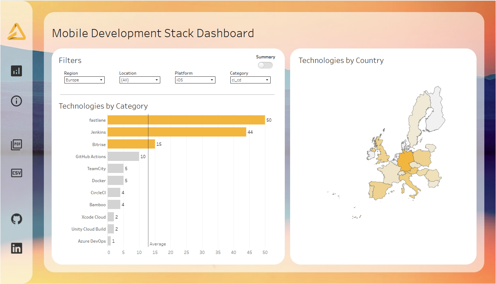

# Mobile Development Stack: What Employers Actually Ask For

An analysis of **2,178 iOS and Android developer job postings** across **35 countries** in Europe
and North America, measuring how often each technology is mentioned — and whether that differs
by region.

**[→ Explore the interactive dashboard](https://public.tableau.com/app/profile/ivan.ireev/viz/mobile_development_stack_dashboard/Dashboard1)**



---

## The question

Job ads are the clearest public signal of what employers expect a mobile developer to know.
But that signal is buried in unstructured prose, written differently by every company, in
several languages.

This project turns that prose into a quantified answer to two questions:

1. Which technologies appear most often in native iOS and Android job postings?
2. Does the answer change depending on whether you target Europe or North America?

---

## What the data shows

**Both platforms repeat the same 17-layer frame.** The layers themselves are identical; what
changes is which technologies fill them and in what order.

**Region barely matters; platform decides everything.** Within a platform, the same technology
leads every layer in both Europe and North America — the single exception is CI/CD on iOS, where
fastlane leads in Europe and Jenkins in North America. Between platforms almost nothing carries
over: only the platform-neutral layers share a leader (Git, Agile, REST API, MVVM, Firebase).
A learned stack transfers between markets, not between platforms.

**The one systematic regional difference is legacy load.** North America mentions older
technologies a bit more often.

Percentages are the share of postings for that platform that mention the technology, averaged
over the two regions — `% = (EU% + NA%) / 2`, counting a region with no mentions as 0. Within
each layer technologies are listed in descending order. The figures are computed directly from
the dataset.

**Two rows come with a caveat.** The cross-platform tools in the UI row (React Native, Flutter)
are artefacts rather than demand: cross-platform and dual-role postings were removed from the
dataset by design. The *Other* row is a catch-all — those postings ask for push-notification
work without naming any specific technology.

| Layer | Android | iOS |
|---|---|---|
| Platform language | Kotlin (79.6%), Java (58.9%) | Swift (87.1%), Objective-C (45.9%) |
| Version control | Git (33.2%) | Git (33.2%), SVN (4.1%) |
| IDE | Android Studio (19.9%) | Xcode (22.7%) |
| Networking (API) | REST API (28.7%), Retrofit (10.0%), GraphQL (4.9%) | REST API (26.1%), GraphQL (5.1%) |
| Methodology and PM tools | Agile (25.7%), Scrum (11.9%), Jira (7.9%) | Agile (26.4%), Scrum (10.9%), Jira (5.4%) |
| UI frameworks | Jetpack Compose (28.6%), React Native (4.6%), Flutter (4.2%) | SwiftUI (35.6%), UIKit (21.5%), Core Animation (10.0%), Cocoa Touch (6.6%), React Native (4.2%) |
| Data storage | Room (7.9%) | Core Data (16.6%) |
| Platform SDK / core components | Android SDK (32.4%), Android NDK (5.3%) | iOS SDK (6.2%) |
| Architecture and DI | Architecture: MVVM (24.2%), MVP (10.0%), Clean Architecture (8.0%), MVC (5.3%), MVI (4.5%)<br>DI: Dagger (12.4%), Hilt (5.8%) | Architecture: MVVM (22.3%), MVC (12.6%), VIPER (5.9%), MVP (5.5%)<br>DI: no framework reaches 2% of postings |
| Publishing channels | Google Play Store / Console (8.4%) | App Store / App Store Connect (8.8%) |
| Asynchrony / reactivity | Kotlin Coroutines (13.8%), RxJava (11.1%), Kotlin Flow (4.0%) | Combine (11.3%), RxSwift (6.9%), GCD (3.4%) |
| Build and dependency management | Gradle (10.3%) | CocoaPods (7.3%), Swift Package Manager (4.2%) |
| Testing | Espresso (7.1%), TDD (6.4%), JUnit (6.0%) | XCTest (5.6%), TDD (5.5%) |
| Additional languages | C++ (10.8%), C (5.7%), JavaScript (4.6%) | JavaScript (6.0%) |
| Cloud / backend services (BaaS) | Firebase (6.7%) | Firebase (3.6%) |
| CI/CD and automation | Jenkins (5.3%) | fastlane (5.2%), Jenkins (5.2%) |
| Other | Notifications (3.9%) | Notifications (7.0%) |

---

## The dashboard

The [Tableau dashboard](https://public.tableau.com/app/profile/ivan.ireev/viz/mobile_development_stack_dashboard/Dashboard1)
presents the same results in explorable form:

- Filters for **region, country, platform and technology category**
- A **Summary** toggle that drops the category grouping and shows aggregate rankings
- Technologies by category, with an average reference line
- A choropleth map of technology mentions by country
- PDF and CSV export

---

## How it was built

```
SerpApi → deduplicate → language detect → translate → section → extract → normalise → analyse
```

| Stage | What happened |
|---|---|
| **Collection** | SerpApi against Google Jobs, queries `iOS developer` and `Android developer`, run 13 Jan 2025. Every country was queried **twice** — once via `google.com`, once via the local Google domain — deliberately trading duplicates for coverage. |
| **Deduplication** | 5,834 raw rows contained only 2,863 unique Job IDs. 2,971 duplicate rows removed (~51%), keeping the `google.com` variant within each country. Postings of 14 words or fewer dropped. |
| **Language** | Detected with `langdetect` (seeded for reproducibility). The 16 low-confidence cases were re-checked with GPT-4o and adjudicated by hand. 86% of postings were already English; the rest were translated via GPT-4o. |
| **Sectioning** | Each posting split by GPT-4o into six parts (Platform, Salary, Requirements, Nice to Have, Responsibilities, Benefits), then parsed into columns with regex. Splitting cut the text volume sent downstream, and therefore API cost. |
| **Platform filter** | 71 distinct platform values reduced to strictly native postings: 1,094 iOS + 1,080 Android, plus 4 Apple-ecosystem cases recovered by manual review. Cross-platform and dual-role ads were removed as out of scope. **Final set: 2,178 postings.** |
| **Extraction** | Requirements, Nice to Have and Responsibilities merged into one field so each posting needed a single API call instead of three. |
| **Normalisation** | Hand-built synonym dictionary mapping variants to canonical form, plus n-gram verification (n=1–3) that each extracted term actually appears in the source text. **926 terms normalised, 389 non-existent terms removed.** |
| **Shaping** | Reshaped wide→long into 12,081 rows. 213 unique technologies manually mapped into 28 categories. |

---

## Validation

Two blind validation experiments were run against manually labelled ground truth, using
Token Set Ratio (`rapidfuzz`). **The 85% acceptance threshold was fixed before either
experiment was run**, and samples were drawn with a fixed seed.

| Experiment | Sample | Result |
|---|---:|---:|
| Sectioning accuracy | 30 postings | **95.60%** mean (range 91.4–99.98% by section) |
| Technology extraction accuracy | 40 postings | **98.71%** |

Ground truth files and comparison scripts are in `data/ground_truth/` and `notebooks/tests.ipynb`,
so both experiments can be re-run and checked.

Note that 98.71% is the accuracy of extraction *before* the normalisation stage. Accuracy was
not re-measured afterwards; the normalisation stage is reported by what it changed (926 terms
normalised, 389 removed), not by a second accuracy score.

---

## Limitations

Stated plainly, because they affect how the results should be read:

1. **Mention frequency is not demand.** Results reflect how employers write ads, not measured
   technology usage.
2. **Translation quality was not independently audited** across the full corpus.
3. **Category assignment was manual**, so borderline technologies could reasonably sit elsewhere.
4. **North America is roughly a quarter of the sample** (~560 postings vs ~1,430 for Europe), so
   NA percentages rest on a smaller base. Gaps of 15+pp survive this comfortably; gaps of 3–5pp
   should not be treated as meaningful.
5. **Normalisation and the stop-list both carry risk** — rare spellings may be mis-mapped, and
   some over-generic terms may have escaped exclusion.
6. **Cross-platform roles were excluded by design.** This dataset therefore says nothing about
   demand for React Native, Flutter or similar.

---

## Repository structure

```
├── notebooks/
│   ├── data_collection.ipynb      # SerpApi collection
│   ├── data_preparation.ipynb     # cleaning, language, sectioning, extraction
│   ├── data_analysis.ipynb        # categorisation, tables, export
│   └── tests.ipynb                # the two validation experiments
├── src/jobs_tools/
│   ├── chat_gpt.py                # GPT-4o API wrappers, async + caching
│   ├── data_cleaning.py           # deduplication, normalisation, hallucination removal
│   ├── jobs_helpers.py            # collection and parsing utilities
│   └── tests_helpers.py           # fuzzy-matching comparison for validation
├── data/
│   ├── csv/                       # dataset at each pipeline stage
│   ├── json/                      # synonym dictionary, category map, stop-list
│   ├── cache/                     # cached LLM responses (see below)
│   ├── ground_truth/              # manual labels for validation
│   └── all_tables.xlsx            # 54 generated result tables
└── tableau/
    └── mobile_development_stack_dashboard.twbx
```

**On the cache directory:** every LLM call is cached to disk by content. The pipeline can be
re-run end to end without re-paying for API calls, and produces identical output — which is
what makes the results reproducible rather than merely documented.

---

## Reproducing the analysis

Requires Python 3.12.

Run the notebooks in order: `data_collection` → `data_preparation` → `data_analysis`.
`tests.ipynb` is independent and reproduces the two validation experiments.


---

## Stack

Python 3.12 · pandas · rapidfuzz · langdetect · OpenAI API (GPT-4o) · SerpApi · Tableau · Jupyter

---

## About

Bachelor's thesis, Estonian Entrepreneurship University of Applied Sciences, 2026.
Sole author. The full thesis is written in Russian.

[Thesis link](https://eek.ee/download.php?t=kb&dok=p1ja91phru1gtg14r1von1r91evh9.pdf)

**Ivan Ireev** — data analyst, Tallinn, Estonia


